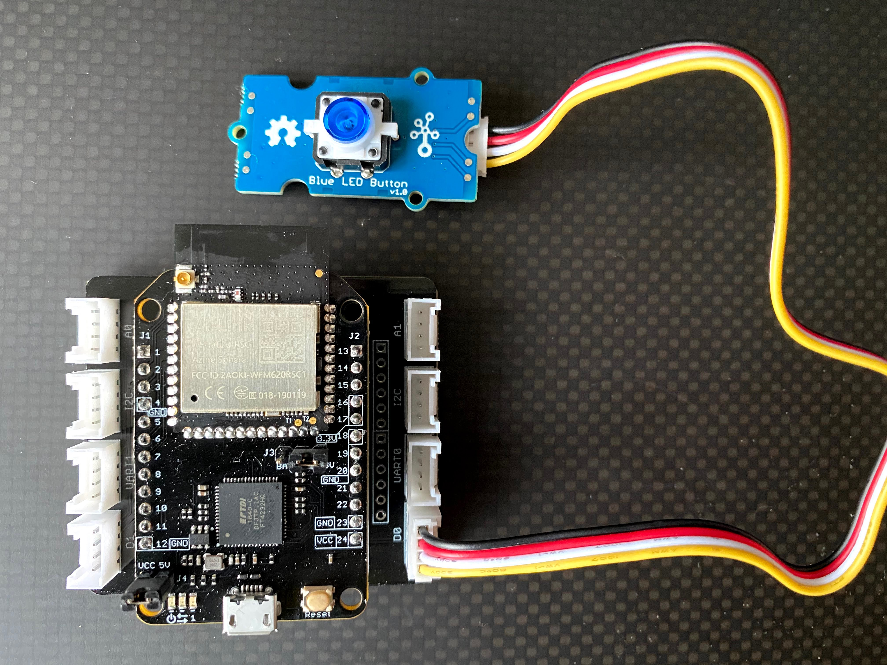

# Seeed Mini Dev Board - Seeed LED Button Demo

This project provides the base template to drive a [Seeed LED Button](https://www.seeedstudio.com/Grove-Blue-LED-Button.html) with the [Seeed Mini Dev Board](https://www.seeedstudio.com/MT3620-Mini-Dev-Board-p-2919.html) using a [MT3620 GROVE Breakout](https://www.seeedstudio.com/MT3620-Grove-Breakout-p-4043.html). You may purchase the individual items from the links above, or alternatively purchase the Mini Dev Board along with the [Azure Sphere Grove Starter Kit for MT3620 Mini Dev Board](https://www.seeedstudio.com/Azure-Sphere-Grove-Starter-Kit-for-MT3620-Mini-Dev-Board-p-4613.html) which will contain additional Grove components.


## Installation
* Hardware
	* Once you have assembled the Mini Dev Board with the Grove Breakout, connect the LED to the D0 breakout. D0 maps to GPIO6 and GPIO30.


* Software
	* Follow instructions provided in the [prerequisites section for Build a high-level application](https://docs.microsoft.com/en-us/azure-sphere/install/qs-blink-application?tabs=windows%2Ccliv2beta&pivots=visual-studio#prerequisites) to ensure your Mini Dev Board is ready for development. 
	* Clone this project or else follow the next steps from the link above while referring to the code in this project. This project uses the AzureSphere HLCore Blank template in Visual Studio. 
  * This project was built using Azure Sphere SDK v21.04. If you have issues with Hardware Definitions, ensure your SDK contains references for the Mini Dev Board (seeed_mt3620_mdb.json). This file can usually be found at "C:\Program Files (x86)\Microsoft Azure Sphere SDK\HardwareDefinitions" or the Linux equivalent folder. The following code in CmakeLists.txt instructs it to include the Hardware Definition file.
  	```c
	azsphere_target_hardware_definition(${PROJECT_NAME} TARGET_DEFINITION "seeed_mt3620_mdb.json")
	```


## Code References
This project borrows code from the following repositories
* https://github.com/Seeed-Studio/MT3620_Grove_Shield


## Contributing
Pull requests are welcome. For major changes, please open an issue first to discuss what you would like to change.

Please make sure to update tests as appropriate.

## License
MIT License

Copyright (c) [2021] [Arjun Ramakrishnan]

Permission is hereby granted, free of charge, to any person obtaining a copy
of this software and associated documentation files (the "Software"), to deal
in the Software without restriction, including without limitation the rights
to use, copy, modify, merge, publish, distribute, sublicense, and/or sell
copies of the Software, and to permit persons to whom the Software is
furnished to do so, subject to the following conditions:

The above copyright notice and this permission notice shall be included in all
copies or substantial portions of the Software.

THE SOFTWARE IS PROVIDED "AS IS", WITHOUT WARRANTY OF ANY KIND, EXPRESS OR
IMPLIED, INCLUDING BUT NOT LIMITED TO THE WARRANTIES OF MERCHANTABILITY,
FITNESS FOR A PARTICULAR PURPOSE AND NONINFRINGEMENT. IN NO EVENT SHALL THE
AUTHORS OR COPYRIGHT HOLDERS BE LIABLE FOR ANY CLAIM, DAMAGES OR OTHER
LIABILITY, WHETHER IN AN ACTION OF CONTRACT, TORT OR OTHERWISE, ARISING FROM,
OUT OF OR IN CONNECTION WITH THE SOFTWARE OR THE USE OR OTHER DEALINGS IN THE
SOFTWARE.
